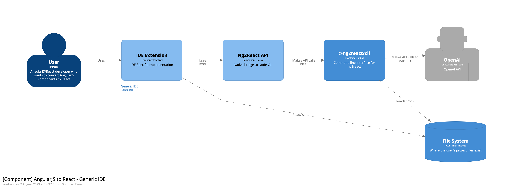

# Contribute

ng2react is a tool that converts AngularJS components to React components using the OpenAI API. It consists of an IDE plugin, a core library, a CLI with native bridge interfaces for non-JavaScript IDEs, and a support library for hybrid AngularJS/React projects.

## IDE Plugin

The ng2react IDE plugin is an essential component of the ng2react software system. It integrates with the user's development environment and provides an interface for converting AngularJS components to React components using the core library.

Two types of IDE plugins are supported:

- **NodeJS Based IDE Plugins**: These plugins are built for IDEs that support NodeJS plugins, such as VSCode and Atom. They can use @ng2react/core directly.
- **Other IDE Plugins**: These plugins are built for IDEs that do not support NodeJS plugins, such as IntelliJ and Eclipse. They can be immpemented via the @ng2react/cli.

### NodeJS Based IDE Plugin

### Other IDE Plugins

### Existing Plugins

- [VSCode](https://marketplace.visualstudio.com/items?itemName=maxbilbow.ng2react-vscode)
- [IntelliJ](https://github.com/ng2react/intellij) (PoC - Contributions welcome)

## How to Contribute

If your target IDE is not JavaScript based (e.g. VSCode), you will need to use or create a bridge API.

### Creating a Native Bridge

To do this, start by finding the appropriate JSON Schema generation library for your target language. For example: the [Java library](https://github.com/ng2react/cli/tree/main/libraries/java) uses the [jsonschema2pojo-maven-plugin](https://mvnrepository.com/artifact/org.jsonschema2pojo/jsonschema2pojo-maven-plugin) to generate the Pojos for interfacing with the [CLI](https://github.com/ng2react/cli)

Submit a PR into the [@ng2react/cli](https://github.com/ng2react/cli) repository with you native bridge implementation.

**Current Native Bridges:**

- Java (for IntelliJ)

### Build your native plugin

Now that you have a native bridge that can interface seamlessly with the CLI, you can build your native plugin. You can maintain it yourself or ask to have it added to the [@ng2react](https://github.com/ng2react) project.

You may look at the VSCode extension for examples but, so log ans you can scan for and convert components, you can build your plugin however you like.

### Scan JavaScript for AngularJS Components

### Convert Component

