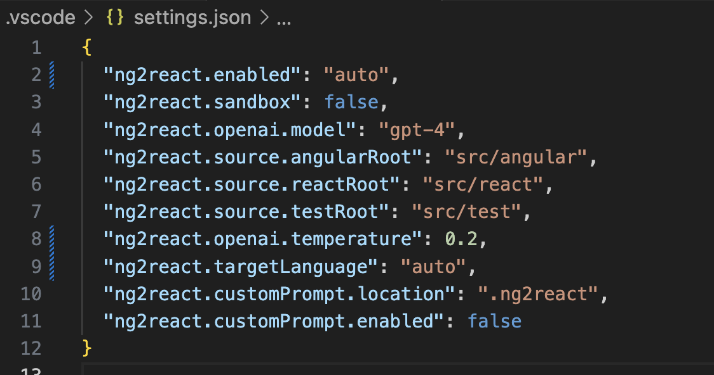

# Getting Started

1. Get an OpenAI API key from <https://openai.com/>
2. Add the OpenAI API key to your IDE extension settings
3. Open an AngularJS project and ensure that the source roots are configured correctly
4. Run the `ng2react: Check Connection` command
5. Install the `@ng2react/support` library in your AngularJS project: `npm install --save @ng2react/support`

## Project Recommendations

### Testing, testing testing

The generated code is not guaranteed to be correct. It is generated by an AI model and may contain bugs. It is highly recommended that you write UI tests that will work for both AngularJS and React.

If you currently use Protractor, you may want to consider switching to [Cypress](https://www.cypress.io). Cypress is a modern testing framework that is much easier to use and maintain than Protractor. It also supports both AngularJS and React.

Good behavioural tests will help you catch bugs in the generated code and have confidence that parity has been achieved.

### Use a UI component library

## Configuration

Important configuration options.

### OpenAI Settings

- `ng2react.openai.apiKey`: The OpenAI API key to use for generating React components from AngularJS components.
- `ng2react.openai.model`: The OpenAI engine to use for generating React components from AngularJS components. Defaults to `gpt-4`.
- `ng2react.openai.temperature`: The OpenAI temperature to use for generating React components from AngularJS components. Defaults to `0.2`.
- `ng2react.openai.orginization`: An optional organization ID assiciated with your OpenAI account and can be used to prevent OpenAI from using your code to train their models.

### Project Settings

- `ng2react.source.angularRoot`: The source root of your AngularJS code. Defaults to `src`.
- `ng2react.source.reactRoot`: The source root of your AngularJS code. Defaults to `src`.
- `ng2react.source.testRoot`: The source root where React unit tests should be generated. Defaults to `src/test`.

## Examples

Have a look at some examples in [@ng2react/examples](https://github.com/ng2react/examples)
