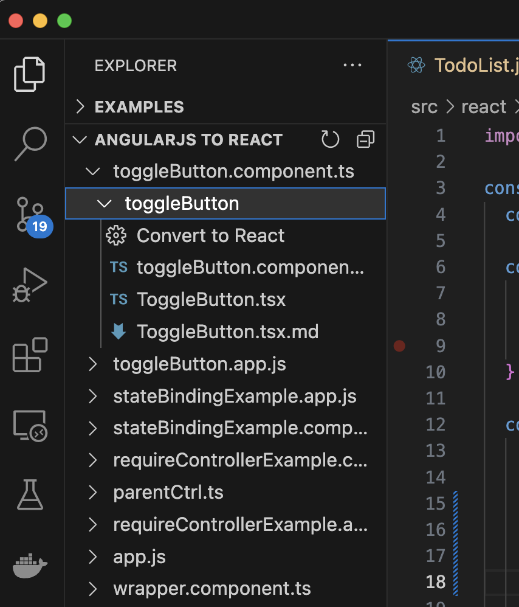
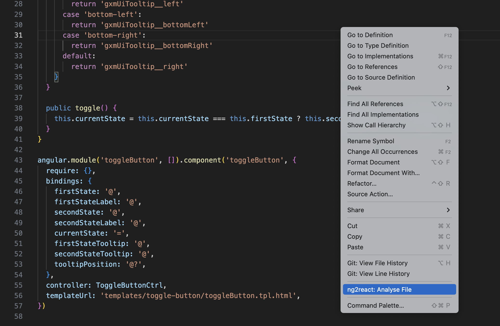
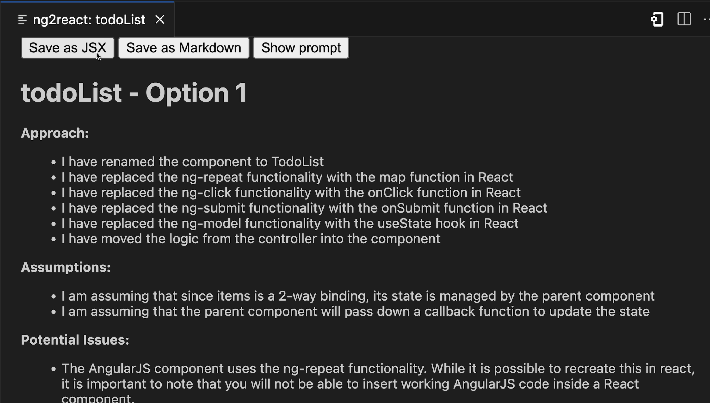
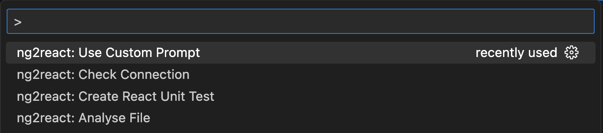

# User Guide

* Tree View
* Context Actions
* Command Palette
* Test Generation

## Tree View: Finding & Converting Components

| | |
|----|----|
| The Ng2React Tree View<br>can be used to identify and convert components |  |

## Context Menu: Analyse and Convert Components

The Ng2React Context Menu can be used to analyse and convert components: 

## Review Output

The Ng2React Output Window can be used to review the generated code. You can save the J/TSX, markdown, and even view the prompt used to generate the code.



## Command Palette



## Wrapping converted components

```jsx
// React Component
import React, { useState } from "react";
import { useService, NgTranslate } from "@ng2react/support";

const MyReactComponent = ({ title }) => {
    const myService = useService("myService");
    const [state, setState] = useState(myService.getState());
    return (
        <>
            <h1>{title}</h1>
            <p>{state}</p>
            <p>
                <NgTranslate id={"TRANLATED_TEXT_ID"}/>
            </p>
        </>
    );
};
```

```js
// AngularJS Component
import * as angular from "angular";
import { angularize } from "@ng2react/support";
import { MyReactComponent } from "./MyReactComponent.jsx";

const myApp = angular.module("myApp", []);
angularize(MyReactElement, {
    module: myApp,
    name: "myAngularComponent",
    bindings: {
        title: "@",
    },
});
```
